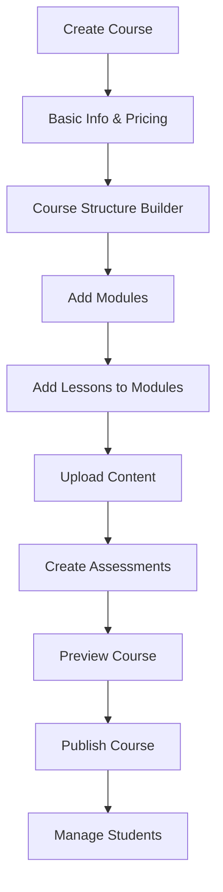
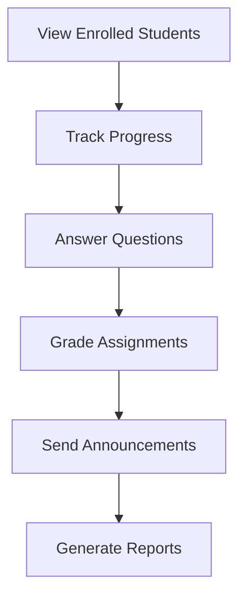
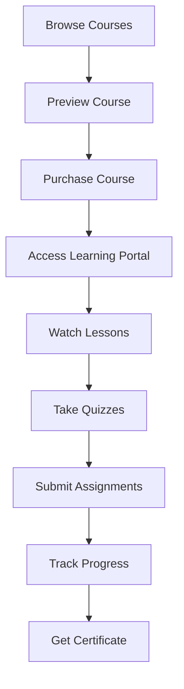
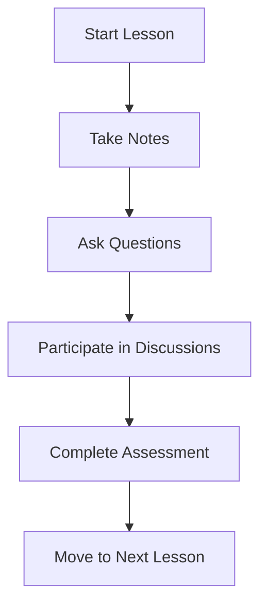

# 🎓 Lecturer-Student Workflow Analysis & Improvement Plan

## 📊 Current State Analysis

### ✅ What You Have (Strong Foundation)
1. **Digital Product Support** - Basic file upload/download system
2. **Product Categories** - "Online Courses & Training" and "Education & Tutoring"
3. **My Purchases Page** - Students can access purchased digital content
4. **Vendor Dashboard** - Lecturers can create and manage products
5. **Payment Integration** - Paystack for course purchases
6. **User Roles** - Customer/Vendor system supports lecturer-student roles

### ❌ Critical Gaps for Education
1. **No Course Structure** - Just file downloads, not organized learning
2. **No Progress Tracking** - Students can't track completion
3. **No Interactive Content** - No quizzes, assignments, or assessments
4. **No Student-Lecturer Communication** - No messaging or Q&A system
5. **No Certificates** - No completion certificates
6. **No Learning Path** - No sequential lesson structure
7. **No Video Player** - No integrated video learning experience
8. **No Class Management** - No cohort or batch management

---

## 🎯 Lecturer Workflow Improvements

### 1. **Enhanced Course Creation Process**

#### Current Flow:
```
Lecturer → Create Product → Upload Files → Set Price → Publish
```

#### Improved Flow:
```
Lecturer → Course Builder → Structure Modules → Add Lessons → 
Upload Content → Set Learning Objectives → Configure Assessments → 
Preview Course → Publish → Manage Students
```

#### Implementation:
```typescript
// lib/types/course.ts
export interface Course extends Product {
  courseType: "self-paced" | "cohort-based" | "live-sessions"
  duration: number // estimated hours
  difficulty: "beginner" | "intermediate" | "advanced"
  prerequisites: string[]
  learningObjectives: string[]
  modules: CourseModule[]
  certificateEnabled: boolean
  dripContent: boolean // Release lessons over time
  cohorts?: CourseCohort[]
}

export interface CourseModule {
  id: string
  title: string
  description: string
  order: number
  lessons: Lesson[]
  quiz?: Quiz
  estimatedDuration: number // minutes
}

export interface Lesson {
  id: string
  title: string
  type: "video" | "text" | "pdf" | "quiz" | "assignment" | "live-session"
  content: string
  videoUrl?: string
  duration?: number // minutes
  resources?: DigitalFile[]
  order: number
  isPreview: boolean // Free preview lesson
}
```

### 2. **Course Management Dashboard**

Create a dedicated course management interface:

```
/vendor/courses/
├── overview/          # Course analytics
├── [courseId]/
│   ├── content/       # Manage modules & lessons
│   ├── students/      # Student management
│   ├── analytics/     # Performance metrics
│   ├── discussions/   # Q&A management
│   └── settings/      # Course settings
```

### 3. **Student Management System**

```typescript
export interface CourseEnrollment {
  id: string
  courseId: string
  studentId: string
  enrolledAt: Date
  progress: {
    completedLessons: string[]
    currentModule: string
    overallProgress: number // percentage
    timeSpent: number // minutes
    lastAccessedAt: Date
  }
  certificates?: Certificate[]
  cohortId?: string
}
```

### 4. **Communication Tools**

- **Course Announcements** - Broadcast to all students
- **Q&A System** - Students ask questions, lecturer answers
- **Discussion Forums** - Student-to-student interaction
- **Direct Messaging** - Private lecturer-student communication
- **Live Chat** - Real-time support during lessons

---

## 🎓 Student Learning Experience Improvements

### 1. **Dedicated Learning Portal**

Create a separate learning interface:

```
/learn/
├── dashboard/         # Student learning dashboard
├── courses/          # Enrolled courses
├── [courseId]/
│   ├── overview/     # Course overview & progress
│   ├── lessons/      # Lesson player
│   ├── resources/    # Downloadable materials
│   ├── discussions/  # Course discussions
│   └── certificate/  # Certificate download
```

### 2. **Enhanced Course Player**

```typescript
// components/course-player/CoursePlayer.tsx
export function CoursePlayer({ course, enrollment }: CoursePlayerProps) {
  return (
    <div className="course-player">
      {/* Video Player with Progress Tracking */}
      <VideoPlayer 
        videoUrl={currentLesson.videoUrl}
        onProgress={updateProgress}
        onComplete={markLessonComplete}
      />
      
      {/* Lesson Navigation */}
      <LessonSidebar 
        modules={course.modules}
        progress={enrollment.progress}
        onLessonSelect={setCurrentLesson}
      />
      
      {/* Interactive Elements */}
      <LessonContent 
        lesson={currentLesson}
        onQuizComplete={handleQuizComplete}
        onAssignmentSubmit={handleAssignmentSubmit}
      />
      
      {/* Note Taking */}
      <NoteTaking 
        lessonId={currentLesson.id}
        timestamp={videoCurrentTime}
      />
    </div>
  )
}
```

### 3. **Progress Tracking System**

```typescript
// lib/progress-tracker.ts
export class ProgressTracker {
  async updateLessonProgress(
    enrollmentId: string, 
    lessonId: string, 
    progress: number
  ) {
    // Update lesson completion
    // Calculate module progress
    // Update overall course progress
    // Trigger completion events
  }
  
  async markLessonComplete(enrollmentId: string, lessonId: string) {
    // Mark lesson as complete
    // Check if module is complete
    // Check if course is complete
    // Generate certificate if applicable
  }
}
```

### 4. **Interactive Learning Features**

#### Quizzes & Assessments
```typescript
export interface Quiz {
  id: string
  title: string
  questions: Question[]
  passingScore: number
  attempts: number
  timeLimit?: number // minutes
}

export interface Question {
  id: string
  type: "multiple-choice" | "true-false" | "short-answer" | "essay"
  question: string
  options?: string[] // for multiple choice
  correctAnswer: string | string[]
  explanation?: string
  points: number
}
```

#### Assignments
```typescript
export interface Assignment {
  id: string
  title: string
  description: string
  dueDate?: Date
  maxPoints: number
  submissionType: "text" | "file" | "both"
  rubric?: AssignmentRubric
}
```

---

## 🔄 Improved User Flows

### Lecturer Journey

#### 1. **Course Creation Flow**


#### 2. **Student Management Flow**


### Student Journey

#### 1. **Learning Flow**


#### 2. **Engagement Flow**


---

## 🛠 Implementation Roadmap

### Phase 1: Core Course Structure (Weeks 1-2)
1. ✅ Create Course data models
2. ✅ Build Course Builder interface
3. ✅ Implement Module/Lesson management
4. ✅ Add course preview functionality

### Phase 2: Learning Experience (Weeks 3-4)
5. ✅ Create Learning Portal
6. ✅ Build Course Player with video support
7. ✅ Implement progress tracking
8. ✅ Add note-taking feature

### Phase 3: Interactive Features (Weeks 5-6)
9. ✅ Add Quiz system
10. ✅ Implement Assignment submission
11. ✅ Create Discussion forums
12. ✅ Build Q&A system

### Phase 4: Advanced Features (Weeks 7-8)
13. ✅ Certificate generation
14. ✅ Advanced analytics
15. ✅ Cohort management
16. ✅ Live session integration

---

## 🎨 UI/UX Improvements

### 1. **Course Builder Interface**
- Drag-and-drop module/lesson organization
- Rich text editor for lesson content
- Video upload with thumbnail generation
- Progress indicators during course creation
- Real-time preview mode

### 2. **Learning Portal Design**
- Netflix-style course browsing
- Progress rings and completion badges
- Dark mode for video watching
- Mobile-responsive design
- Offline content download

### 3. **Dashboard Enhancements**
- Lecturer: Student progress heatmaps, revenue analytics
- Student: Learning streaks, achievement badges, progress charts

---

## 📊 Key Metrics to Track

### Lecturer Metrics
- Course completion rates
- Student engagement scores
- Revenue per course
- Student satisfaction ratings
- Time to course creation

### Student Metrics
- Learning progress
- Time spent in courses
- Quiz/assignment scores
- Course completion rate
- Engagement level

---

## 🚀 Quick Wins (Implement First)

### Week 1 Quick Wins:
1. **Course Categories** - Add specific course subcategories
2. **Course Preview** - Allow free preview lessons
3. **Basic Progress Tracking** - Track lesson completion
4. **Student Dashboard** - Show enrolled courses

### Week 2 Quick Wins:
5. **Video Player** - Integrate video player with progress
6. **Course Structure** - Module/lesson organization
7. **Q&A System** - Basic question/answer functionality
8. **Completion Certificates** - PDF certificate generation

---

## 💡 Unique Competitive Advantages

### 1. **Integrated Marketplace + LMS**
Unlike standalone LMS platforms, you combine:
- Course creation and selling
- Student management
- Payment processing
- Marketing tools (your advertising system!)

### 2. **Multi-Vendor Education Platform**
- Multiple lecturers on one platform
- Cross-course recommendations
- Bulk course purchases
- Lecturer collaboration features

### 3. **Nigerian Market Focus**
- Naira pricing and local payment methods
- Nigerian educational content
- Local language support
- Cultural relevance

---

## 🎯 Success Metrics

### 6-Month Goals:
- 100+ courses published
- 1,000+ student enrollments
- 80%+ course completion rate
- 4.5+ average course rating
- ₦5M+ in course revenue

### Key Performance Indicators:
- **Lecturer Satisfaction**: Course creation time < 2 hours
- **Student Engagement**: Average session time > 30 minutes
- **Platform Growth**: 20% month-over-month growth
- **Quality**: 90%+ positive reviews

---

This comprehensive plan transforms your marketplace into a full-featured educational platform that rivals Udemy, Coursera, and other major LMS platforms while maintaining your unique marketplace advantages!

Would you like me to start implementing any specific part of this plan?
